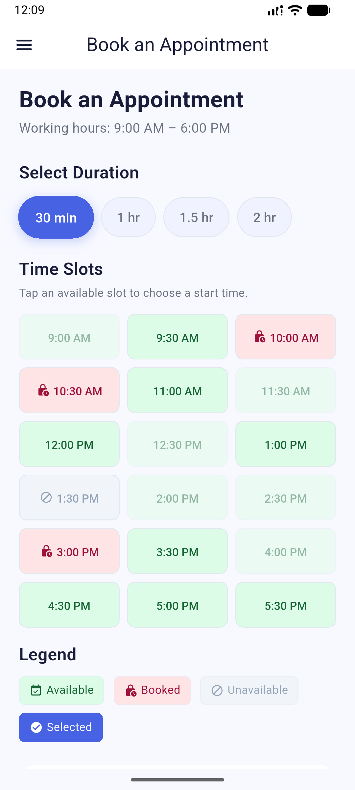
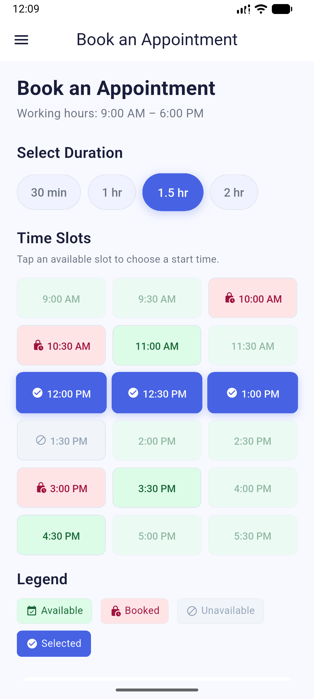
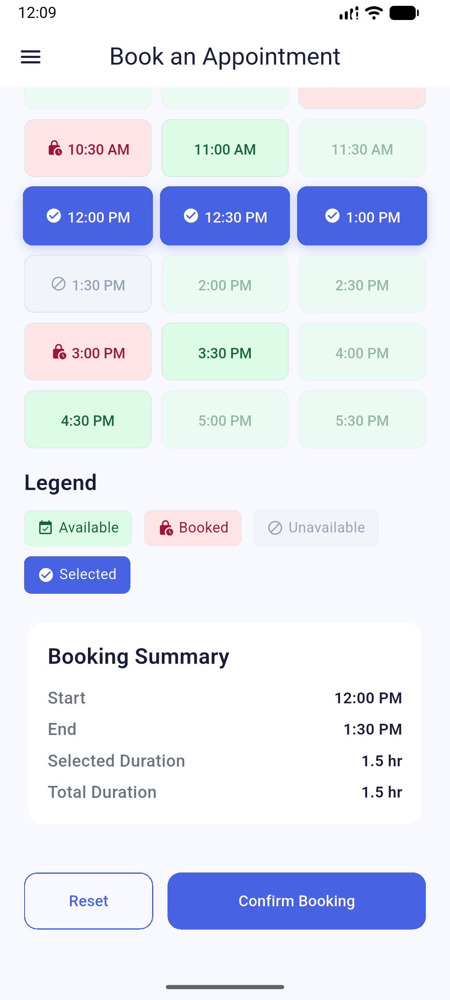
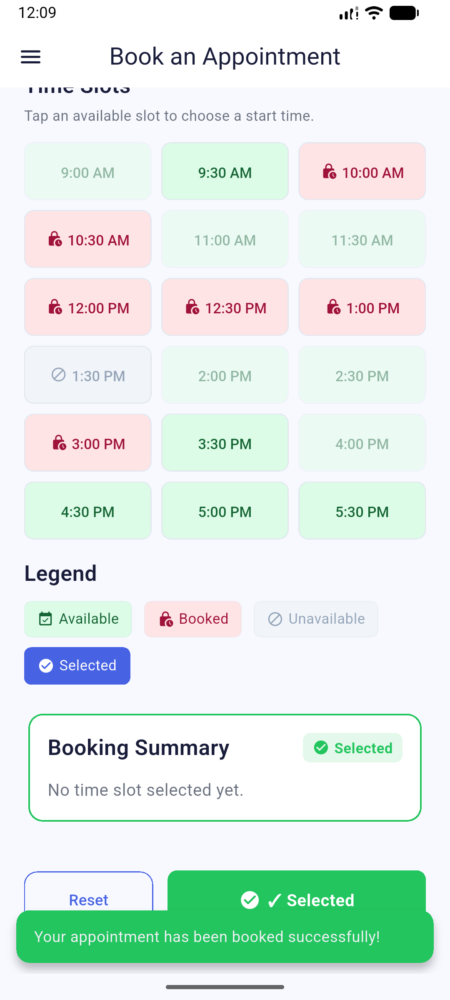
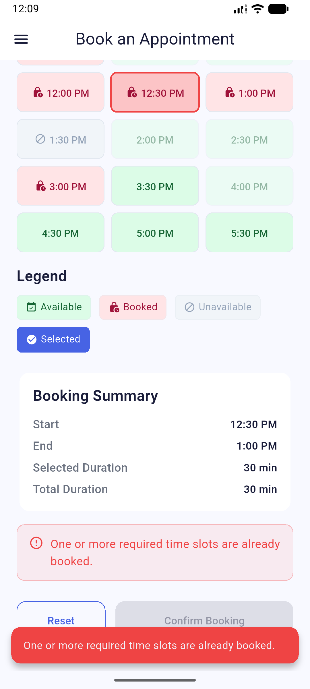
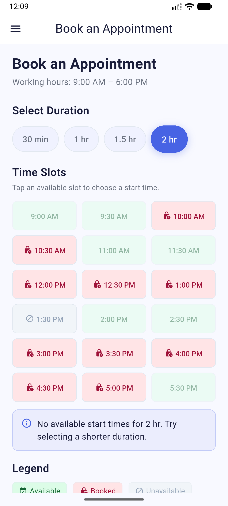
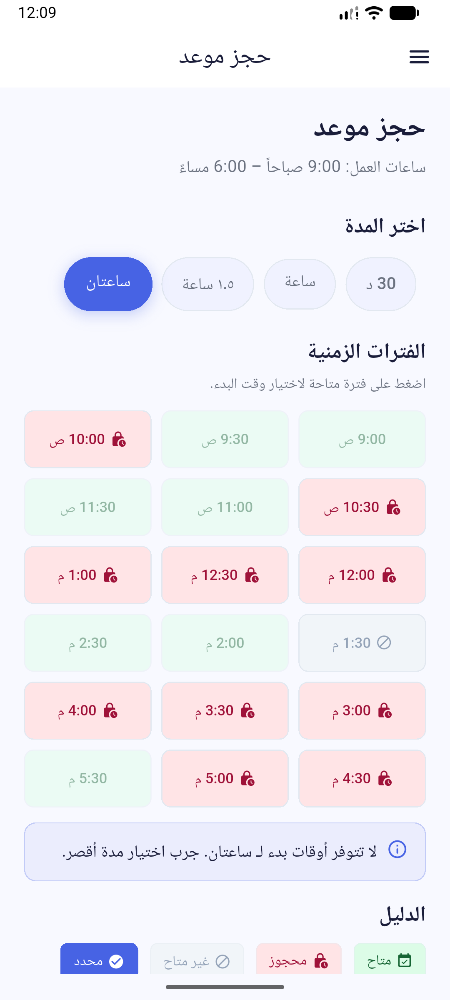
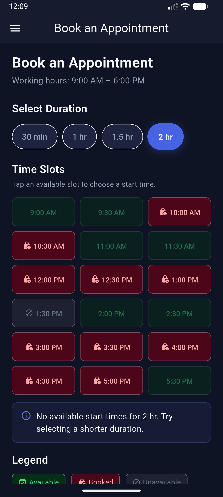

# Serv5 Appointment Booking App 📅

An offline-first, highly responsive Flutter appointment booking application built as an **internship technical assessment for Serv5**. The project strictly adheres to Clean Architecture, BLoC/Cubit state management, and modern Flutter best practices.

---

## 📸 App Screenshots

| Main Booking Screen | Duration Selection | Slot Selection | Validation Error |
| :---: | :---: | :---: | :---: |
|  |  |  |  |
| **Initial Working Schedule** | **Dynamic Duration Options** | **Active Slot Selection** | **X-O-X Gap Validation** |

| Dark Theme | Navigation Drawer | Arabic Localization | Confirmation / Reset |
| :---: | :---: | :---: | :---: |
|  |  |  |  |
| **Dark Theme Mode** | **App Settings & Navigation** | **Full Arabic (RTL) Support** | **Reset & Local Storage** |

---

## 📝 Internship Task Description (Serv5)

> **Task Statement**:
> "We need a booking screen built using Flutter, without an API or backend.
> 
> The day runs from 9:00 AM to 6:00 PM, and appointments are scheduled in 30-minute intervals.
> 
> Some appointments are already booked, and some are unavailable.
> 
> The user can select the start time and duration of the booking:
> * 30 minutes
> * 1 hour
> * 1.5 hours
> * 2 hours
> 
> **Requirements**:
> * Users cannot select a time slot that is already booked or unavailable.
> * Appointments must be consecutive.
> * An appointment cannot overlap with any existing appointment.
> * A reservation cannot extend past 6:00 p.m.
> * When the reservation duration is changed, the times are automatically rechecked.
> * The start time, end time, and selected duration are displayed.
> 
> **Key part of the task**:
> It is prohibited to create a reservation that leaves only a 30-minute gap between two reservations.
> 
> *Example*:
> X = Booked time | O = Available time
> `X O X`
> The system must not allow this situation to occur after a new booking is made.
> 
> *Another example*:
> If we have:
> 9:00 Available | 9:30 Available | 10:00 Available | 10:30 Booked
> and the user selects a one-hour reservation, the system must determine the times at which the reservation can actually begin and prevent any selection that results in a conflict or an invalid period between reservations.
> 
> If the user changes the start time or duration of the reservation, all calculations must update immediately.
> If the user attempts to make an invalid selection, a clear reason must be displayed.
> 
> **Additional Requirements**:
> * Reset button.
> * Display the total duration of the reservation.
> * Clearly distinguish between available, reserved, and selected time slots.
> * All data must be stored locally.
> * Pay attention to code organization and separate the logic from the UI.
> 
> The task will be evaluated based on the correctness of the logic, handling of different cases, code organization, and state management."

---

## 📁 `lib/` Folder Structure

Below is the complete project structure following **Clean Architecture** principles and single-responsibility decomposition:

```
lib/
├── main.dart                          # Application entry point & service locator initialization
├── core/                              # Core shared infrastructure
│   ├── cache/                         # Storage helpers & key constants
│   │   ├── cache_key.dart             # SharedPreferences key definitions
│   │   ├── shared_preferences_helper.dart  # Low-level SharedPreferences wrapper
│   │   └── shared_preferences_service.dart # High-level local storage service
│   ├── errors/                        # Error & Failure definitions
│   │   └── failures.dart              # Standardized Failure classes
│   ├── extensions/                    # BuildContext helper extensions
│   │   └── snack_bar_extensions.dart  # Context SnackBar helpers
│   ├── functions/                     # Shared UI helper functions
│   │   └── show_snack_bar.dart        # SnackBar display utility
│   ├── routing/                       # Routing configuration
│   │   ├── app_router.dart            # GoRouter configuration & routes setup
│   │   └── app_routes.dart            # Static route paths constants
│   ├── services/                      # Application core services & DI
│   │   ├── services_locator.dart      # GetIt dependency injection registry
│   │   ├── settings_cubit.dart        # Theme and Locale settings Cubit
│   │   └── settings_state.dart        # Settings state definitions
│   ├── theme/                         # Theme definitions
│   │   ├── app_theme.dart             # Theme data accessor facade
│   │   ├── dark_theme.dart            # Dark mode ThemeData definition
│   │   └── light_theme.dart           # Light mode ThemeData definition
│   └── utils/                         # Design system tokens & constants
│       ├── app_colors.dart            # Semantic color palette tokens
│       ├── app_constants.dart         # App-wide string & numerical constants
│       └── app_text_styles.dart       # Typography text styles
├── features/                          # Feature modules
│   └── booking/                       # Appointment Booking Feature
│       ├── data/                      # Data Layer
│       │   ├── booking_repository_impl.dart # Booking Repository implementation with local persistence
│       │   └── local_schedule.dart    # Initial mock/seed schedule data generator
│       ├── domain/                    # Domain Layer (Business Logic Core)
│       │   ├── booking_repository.dart# Abstract Booking Repository interface
│       │   ├── booking_schedule.dart  # Schedule entity domain model
│       │   ├── booking_validation_result.dart # Validation outcome status & message
│       │   ├── booking_validator.dart # Validation service (X-O-X gap detection & constraints)
│       │   └── time_slot.dart         # TimeSlot entity model & status enum
│       └── presentation/              # Presentation Layer
│           ├── manager/               # State Management
│           │   ├── booking_cubit.dart # Booking Cubit managing selection & validation logic
│           │   └── booking_state.dart # Immutable Booking States
│           ├── views/                 # Screen Views
│           │   └── booking_view.dart  # Root Booking Screen View
│           └── widgets/               # Modular UI Widgets
│               ├── animated_drawer_button.dart    # Drawer toggle button with animation
│               ├── app_drawer_widget.dart         # Side navigation drawer (Theme & Language)
│               ├── booking_action_bar_widget.dart # Confirm & Reset action bar
│               ├── booking_header_widget.dart     # Top header banner & title
│               ├── booking_summary_widget.dart    # Summary card displaying Start, End, & Duration
│               ├── booking_view_body.dart         # Main screen layout structure
│               ├── drawer_header_widget.dart      # Header for navigation drawer
│               ├── duration_chip_widget.dart      # Selectable duration option chip
│               ├── duration_selector_widget.dart  # Duration selector bar (30m, 1h, 1.5h, 2h)
│               ├── language_selector_tile_widget.dart # Language selection tile (EN / AR)
│               ├── legend_item_widget.dart        # Slot legend indicator item
│               ├── no_available_slots_widget.dart # Fallback state when schedule is fully booked
│               ├── slot_cell_widget.dart          # Individual time slot grid cell button
│               ├── slot_legend_widget.dart        # Grid color legend bar
│               ├── staggered_entrance_widget.dart # Staggered list/grid entrance animation
│               ├── summary_row_widget.dart        # Key-value row for summary card
│               ├── theme_selector_tile_widget.dart# Theme toggle selection tile
│               ├── time_slot_grid_widget.dart     # Responsive grid of time slots
│               └── validation_error_widget.dart   # Validation feedback / warning container
└── l10n/                              # Internationalization (Localization)
    ├── app_ar.arb                     # Arabic translation dictionary
    ├── app_en.arb                     # English translation dictionary
    ├── app_localizations.dart         # Generated Flutter localization delegates
    ├── app_localizations_ar.dart      # Generated Arabic localization class
    └── app_localizations_en.dart      # Generated English localization class
```

---

## 🛠️ Key Implementation & Business Logic Highlights

### 1. Isolated Gap Detection (`X-O-X` Rule)
The validator evaluates whether placing a reservation would leave a single isolated 30-minute free slot surrounded by reserved/unavailable slots:
- Evaluates the schedule status **before** and **after** hypothetical booking placement.
- Only rejects if the booking *creates a new* isolated gap. Pre-existing gaps prior to the user's interaction do not block valid bookings elsewhere.

### 2. Immediate Re-checking on Duration/Start Change
- Selecting a start slot automatically computes the required consecutive slots based on the chosen duration.
- Changing the duration while a start time is active immediately re-runs the validation logic to verify whether the new length fits or causes a conflict / isolated gap.

### 3. State Management & Persistence
- Built with **Flutter BLoC/Cubit** (`BookingCubit` & `SettingsCubit`).
- Local storage persistence via `SharedPreferencesService` ensures that user reservations persist across app restarts and can be completely reset back to initial schedule states using the **Reset Button**.

---

## 🚀 Getting Started

### Prerequisites
- [Flutter SDK](https://flutter.dev/docs/get-started/install) `>=3.0.0`
- [Dart SDK](https://dart.dev/get-started/sdk) `>=3.0.0`

### Setup & Run

1. **Clone the repository**:
   ```bash
   git clone https://github.com/ahmed-eltantawi/booking_appointments.git
   cd booking_appointments
   ```

2. **Install dependencies**:
   ```bash
   flutter pub get
   ```

3. **Run the app**:
   ```bash
   flutter run
   ```

4. **Run Unit & Widget Tests**:
   ```bash
   flutter test
   ```